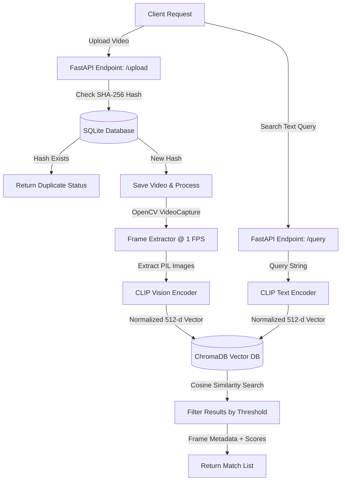

# Production-Grade Video Analytics System

A modular, production-ready FastAPI backend designed to process uploaded video files, extract frames at a controlled rate (1 FPS), generate multimodal embeddings using Hugging Face's CLIP model (`openai/clip-vit-base-patch32`), store frame embeddings in a vector database (ChromaDB), and enable semantic natural language queries.

---

## Architecture Design



### Components
1. **FastAPI**: Lightweight, modern, asynchronous web framework orchestration.
2. **OpenCV (cv2)**: High-performance frame extraction & FPS calculation.
3. **Pydantic v2 & Settings**: Strict data validation, schema enforcement, and environment validation.
4. **SQLAlchemy**: Relational mapping used to verify and log SHA-256 hashes of videos, preventing costly redundant frame processing.
5. **Hugging Face CLIP (`openai/clip-vit-base-patch32`)**: Dual-encoder transformer model producing joint image-text embeddings for semantic search without manual labeling.
6. **ChromaDB**: High-performance local vector database storing embeddings with cosine distance index (`hnsw:space: cosine`).

---

## File Structure

```text
C:\Users\Laptop\video_analytics_tool\
│
├── app/
│   ├── __init__.py          # Marks app/ as a Python package
│   ├── config.py            # Pydantic v2 environment validator
│   ├── database.py          # SQLAlchemy models, SQLite configuration
│   ├── schemas.py           # Request and response models
│   └── video_processor.py   # OpenCV extraction & CLIP vector embedding pipeline
│
├── .env                     # Configuration file for storage paths and database URLs
├── requirements.txt         # Pinned python packages with CPU-only torch configuration
├── main.py                  # API orchestration and HTTP routes
└── README.md                # System documentation
```

---

## Edge Cases Handled

1. **Duplicate Uploads**: Uses a database-level SHA-256 hash lookup. If a duplicate hash is detected, it bypasses the processing stage and directly returns the existing metadata.
2. **Corrupted or Unsupported Videos**: OpenCV detects unreadable frames, zero FPS counts, or missing index details, raising high-specificity `ValueError`s that return HTTP 422 to the client.
3. **Version Differences in Hugging Face Outputs**: Implements automated checks on model outputs, transforming both `Tensor` returns and model dataclass outputs (like `BaseModelOutputWithPooling`) to ensure PyTorch `Tensor` alignment before computing norms.
4. **No Matches & Threshold Filters**: Users specify a confidence range `[0.0, 1.0]`. Queries below the threshold return a clean, empty list message instead of failure exceptions.
5. **Query Text Integrity**: Pydantic forces minimum character requirements (`min_length=3`) to prevent query noise and empty searches.

---

## Setup & Running Instructions

### Prerequisite
Ensure Python 3.10 to 3.12 is installed.

### Option A: Conda Activation (Recommended)
If you already have the environment configured as requested:
```powershell
# Activate the existing Conda environment
conda activate video_tool_env

# Run the FastAPI server via Uvicorn
uvicorn main:app --host 127.0.0.1 --port 8080 --reload

```
###Open a second terminal 
```
conda activate video_tool_env
streamlit run ui.py
```

### Option B: Local Venv Setup
```powershell
# Create virtual environment
python -m venv .venv

# Activate virtual environment
.venv\Scripts\activate.bat

# Install pinned requirements
pip install -r requirements.txt

# Run the server
uvicorn main:app --host 127.0.0.1 --port 8080 --reload
```

---

## Sample Queries and API Endpoints

### 1. Upload Video
* **Endpoint**: `/upload`
* **Method**: `POST`
* **Content-Type**: `multipart/form-data`
* **Request Body**: File (`file`)
* **Curl Command**:
```bash
curl -X POST "http://127.0.0.1:8000/upload" -H "accept: application/json" -H "Content-Type: multipart/form-data" -F "file=@/path/to/video.mp4"
```

* **Sample Response (New Upload)**:
```json
{
  "message": "Video processed successfully. Extracted 15 frames.",
  "video_id": "vid_abc12345",
  "file_hash": "abc1234567890abcdef...",
  "status": "processed"
}
```

* **Sample Response (Duplicate Upload)**:
```json
{
  "message": "Duplicate video detected. Bypassing processing.",
  "video_id": "vid_abc12345",
  "file_hash": "abc1234567890abcdef...",
  "status": "duplicate"
}
```

---

### 2. Query Semantic Search
* **Endpoint**: `/query`
* **Method**: `POST`
* **Content-Type**: `application/json`
* **Request Body**:
```json
{
  "query": "a red car driving on a street",
  "threshold": 0.23
}
```
* **Sample Response**:
```json
{
  "query": "a red car driving on a street",
  "results": [
    {
      "frame_path": "./storage/frames/vid_abc12345_frame_12.00.jpg",
      "timestamp": "12.00",
      "similarity_score": 0.2854
    },
    {
      "frame_path": "./storage/frames/vid_abc12345_frame_13.00.jpg",
      "timestamp": "13.00",
      "similarity_score": 0.2512
    }
  ],
  "message": "Matches found."
}
```
